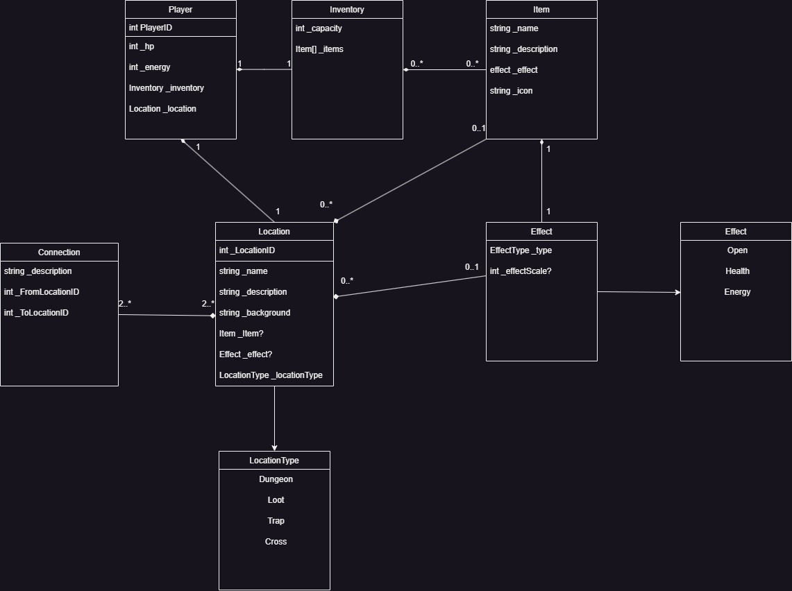

<h1>Gamebook: Escape The Fortress</h1>

Odehrávající se ve fantasy světě, konkrétně v "opuštěné" pevnosti, ze které se pokusí hráč dostat strastiplnou cestou skrz jeskyni, katakomby a nakonec i samotnou pevnost ven na svobodu.

Hráč bude moct poznat v jaké úrovni je podle poškození interiéru či enemáků nebude muset koukat jen tupě na hodnoty...

Hráč hraje za neobyčejného zloděje, který se pokoušel ukrást Svatý Grál plukovníku Azazelovi, který ho ukořistil na jedné ze svých válečných výprav.

Hráč byl ale velmi brzy odhalen jednou z jeho hlídek a za trest byl svržen do nedaleké propasti

Vaším úkolem je dostat se z propasti zpět do pevnosti, ukrást Svatý Grál a následně uprchnout

## Mechaniky
### Hráč
<ul>
    <li>Hráč může získat brnění, to bude přičítat odpor poškození</li>
    <li>Pokud bude nalezeno nové brnění, tak se to staré automaticky odebere s inventáře, stejně budou fungovat zbraně</li>
    <li>Zbraně násobí damage, brnění přičíta resistance</li>
    <li>Resistence redukujue poškození, které hráč utrpí</li>
    <li>Pokud hráč zemře, tak hraje úplně od začátku</li>
</ul>

### Souboje
<ul>
    <li>Hráč může provést slabý útok anebo silný útok</li>
    <li>Slabý útok dává zhruba 1x tolik jaký má hráč Damage, ale je to trochu znáhodněné</li>
    <li>Silný útok dává 1.8x tolik co slabý útok</li>
    <li>Silný útok ale stojí 15 energie, kterou si musí doplňovat jídlem či lektvaremt atd.</li>
    <li>Resistence redukuje poškození, které by měl hráč obdržet od nepřítele</li>
    <li>Na protivníka lze použít item, který ho nějak ovlivní</li>
    <li>Během souboje může hráč použít některý ze svých itemů k vyléčení se</li>
</ul>

### Hádanky
<ul>
    <li>Některé místnosti budou v podstatě hádanky, které následně odemnkou cestu do dalších místností</li>
    <li>Některé hádanky vyžadují indicie rozmístěné v jiných místnostech</li>
    <li>Hráč má pokusů kolik jenom chce</li>
</ul>

### Mapa 
<ul>
    <li>
        Mapa je rozdělena na 3 stage , každé podlaží obsahuje cca 10-20 místností.
    </li>
    <li>Klíče budou sloužit k odemčení spojení mezi místnostmi. Pokud hráč nebude mít požadovaný item, tak danný connection nemůže použít.</li>
    <li>Každá lokace má pole connection, při přesunu budeme porovnávat zda id místnosti kam chceme jít je validní vzhlek k CurrentLocationID, které je zapsané v modelu hráče.</li>
</ul>

#### Podvádění
<ul>
    <li>Podvádění pomocí přepsání id lokace v adresním řádku nebude možné, jelikož dané přesměrování bude kontrolováno. Pokud bude požadované přesměrování vyhodnoceno jakožto nevalidní tak hráč bude přesměrován do lokace, ve které byl naposledy</li>
    <li>Pokud se hráč pokusí dostat na konec hry přepsáním adresního řádku, tak bude místo toho přesměrován na úvodní stránku a veškerá jeho herní data uložená v session budou smazána</li>
</ul>

### Data
<ul>
    <li>Herní data v jednotlivých JSON souborech</li>
    <li>Jediné co se v průbehu hry mění je model hráče, do kterého je zahrnut i CombatState, všechny ostatní dat zůstávají po celou dobu stejná (lokace, itemy, connectiony...)
    <li>Data hráče se ukládají do session</li>
</ul>

## Figma návrh
<a href="https://www.figma.com/file/QgTaAXxr2krxgQlMT8mOTe/GAMEBOOK?type=design&node-id=0-1&mode=design">zde</a>

## Model tříd

